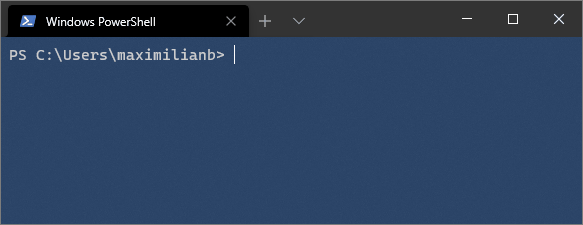
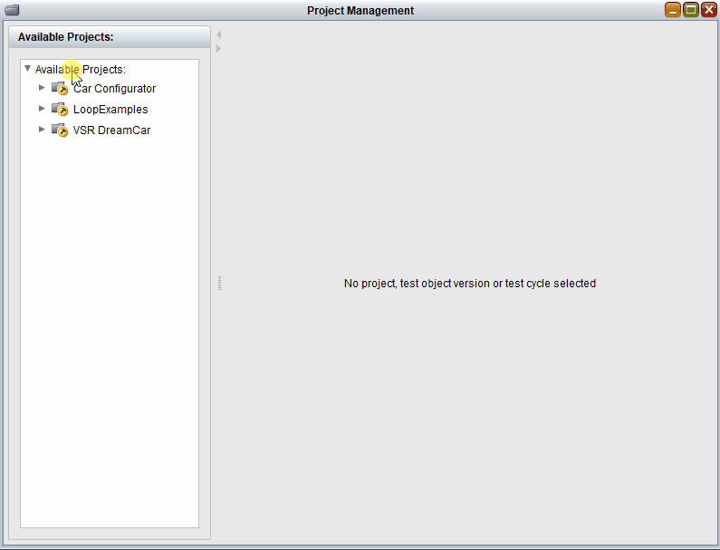
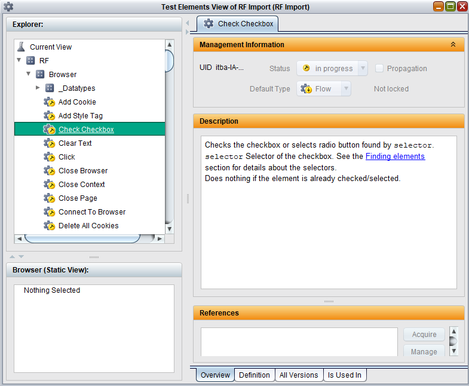

# Libdoc2TestBench
Robot Framework Libdoc Extension that generates imbus [TestBench Enterprise](https://www.imbus.de/en/testbench-enterprise) Library import formats.
It can be used to generate Testbench interactions from Robotframework keywords.
___

### Installation:

To install this package you can use  `pip`:

```bash
pip install robotframework-libdoc2testbench
```

*Notice: This extension requires Robot Framework 4.0.0 or later and does not work with earlier versions.*
___
### Usage:

There are four main use cases:
* Importing official robotframework librarys
* Importing custom robotframework librarys
* Importing resource files
* Importing multiple librarys and resource files at once

#### Importing official robotframework librarys



The basic usage just needs the ``Libdoc2TestBench`` command and a Robot Framework Library as input and saves a zip-file named `project-dump.zip` in the current working directory containing the needed information for the import.

```bash
Libdoc2TestBench <LIBRARY>
```
`<LIBRARY>` corresponds to the name that you would use to import the library into a robot framework file.
Browser is an example for `<LIBRARY>`.
By using a second positional argument you can additionally specify the output filename:

```bash
Libdoc2TestBench <LIBRARY> <output.zip>
```

Afterwards the generated zip-file can be imported via the `Import Project...` command in the Project Management view of the imbus TestBench:



In the Test Elements view you can now see your imported RF library as different interactions and datatypes:



The imported Testelements can be copied into another testbench project. When copying, it is important that the test elements remain in the same subdivisions. The name of the root subdivision can be renamed with the --libraryroot option.

#### Importing custom robotframework librarys

Libdoc2Testbench can be used to import your own robotframework librarys.

Example for a custom library:
```python
class mycustomlibrary(object):
    def print_hello_world(self):
        print("Hello World")
```

Example Libdoc2Testbench usage:

```bash
Libdoc2TestBench mycustomlibrary.py
```

#### Importing resource files

Libdoc2Testbench can be used to import resource files.

Example for a resource file:

```robotframework
*** Keywords ***
print hello world
	log	Hello World
```

Example Libdoc2Testbench usage:

```bash
Libdoc2TestBench -a myresource.resource
```

#### Importing multiple librarys and resource files at once

Libdoc2Testbench can be used to import multiple librarys and resource files at once. A special robot framework section is used for this use case.

Example for a import List:

```robotframework
*** Import List ***
BrowserLibrary
BuiltIn
mycustomlibrary.py
myresource.resource
```

Example Libdoc2Testbench usage:

```bash
Libdoc2TestBench -a importlist.robot
```

___
### Command line arguments
There are several optional arguments, that follow the structure of the robot.libdoc module. When generating imports from a RF library, these values should already be set up correctly. You may overwrite the docformat and other meta data by setting the associated arguments written below.

| Arguments 	| Description 	| Allowed Values 	|
|-	|-	|-	|
| `-h`, `--help` | show the help message and exit
| `-a`, `--attachment` |  Defines if a resource file will be attached to all interactions.
| `-F FORMAT`, `--docformat FORMAT` 	| Specifies the source documentation format.  Possible values are Robot Framework's documentation format, HTML, plain text, and reStructuredText.  The default value can be specified in library source code and the initial default value is `ROBOT`. 	| `ROBOT` `HTML` `TEXT` `REST` 	|
| `--libraryroot LIBRARYROOT`| Defines which subdivision name contains libraries.
| `--libversion LIBVERSION` | Sets the version of the documented library or resource written in the description.
| `-n NAME`, `--name NAME` 	| Sets the name of the documented library or resource. 	|  	|
| `-r REPOSITORY`, `--repository REPOSITORY`| Sets the repository id of the TestBench import. The default is `itba`.||
| `--resourceroot RESOURCEROOT` | Defines which subdivision name contains resources.
| `-s SPECFORMAT`, `--specdocformat SPECFORMAT` 	| Specifies the documentation format used with XML and JSON spec files.  `RAW` means preserving the original documentation format and `HTML` means converting documentation to HTML.  The default is `HTML`. 	| `HTML` `RAW` 	|
|`-t TEMP`, `--temp TEMP`| Path to write temporary files to.|
| `-x`, `--xml`| Writes a single xml-file instead of the zipfile.|
| `--version`, `--info` 	| Writes the Libdoc2TestBench, Robot Framework and Python version to console. 	|  	|
___

### Change log
* 1.0rc2
    * ADDED optional arguments for:
        * xml-file output (instead of zip-file)
        * custom temporary directory
        * changing the repository id in the xml-header
        * custom primary key enumeration start
        * info command for printing Libdoc2TestBench/Robot Framework/Python version to console
        * support for resource-files (attachment support coming soon)
    * FIX:
        * only create `_Datatype` subdivison in libraries when data types are present
        * `Resource` subdivison is now in the correct parent subdivision
        * Updated README.md / package help-messages to reflect changes
* 1.0rc1
    * first release candidate

___
### License
Distributed under the [Apache-2.0 license](https://github.com/imbus/robotframework-libdoc2testbench/blob/main/LICENSE). See [LICENSE](LICENSE) for more information.
___
### Dependencies
 - python >= 3.7
 - [robotframework](https://github.com/robotframework/robotframework) >= 4.0.0
___
### Contributing
[](https://github.com/psf/black)
For consistent code formatting, please use [Black - The Uncompromising Code Formatter](https://github.com/psf/black) with the following arguments in the root directory:
```bash
black -l 100 -S .
```