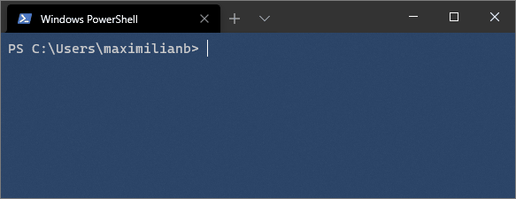
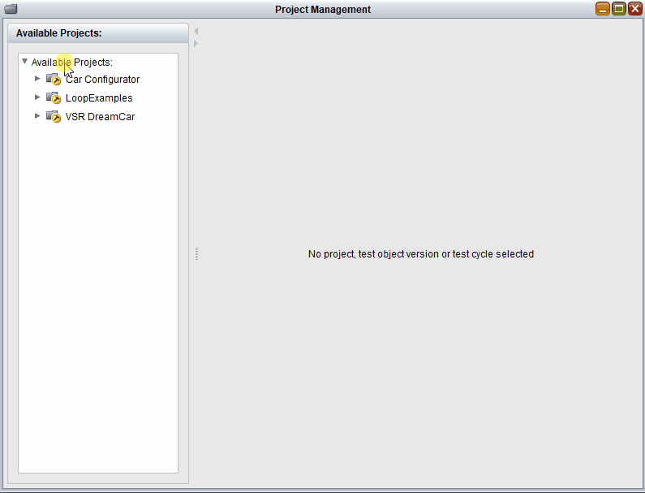
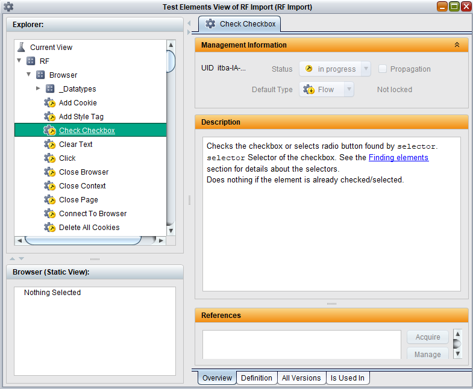

# Libdoc2TestBench
Libdoc2TestBench is a Robot Framework extension that generates import formats compatible with imbus [TestBench](https://www.imbus.de/en/testbench-enterprise).
It can be used to generate Testbench interactions and datatypes from Robot Framework libraries.
___

### Installation:

To install this package you can use the following `pip` command:

```bash
pip install robotframework-libdoc2testbench
```

*Notice: This extension requires Robot Framework 5.0.0 or later and does not work with earlier versions.*
___
### Usage:

There are three main use cases:
* Import official Robot Framework libraries
* Import custom Robot Framework libraries
* Import Robot Framework resource files

#### Import Official Robot Framework Libraries



For the most basic usage, simply pass a Robot Framework library as an argument to the ``Libdoc2TestBench`` command. ``Libdoc2TestBench`` will create a zip file with the name of the library in the current working directory. This zip file can be imported into TestBench to use Robot Framework keywords within TestBench.

```bash
Libdoc2TestBench <LIBRARY>
```
The ``<LIBRARY>`` argument corresponds to the Robot Framework library name that you would use to import the library in the ``*** Settings ***`` section of a robot/resource file. The second positional argument can be used to specify the name of the generated zip file:

```bash
Libdoc2TestBench <LIBRARY> <output.zip>
```

#### Import the generated TestBench zip file

The generated zip file can be imported via the ``Import Project...`` menu entry in the Project Management view of imbus TestBench:



Afterwards, you'll find your imported Robot Framework library, the different interactions and the datatypes in the Test Elements view:



The imported test elements can be copied to any other TestBench project.

#### Import custom robotframework librarys

Libdoc2TestBench can also be used to import custom Robot Framework libraries or resource files. For that purpose, you can specify the path to your Python or resource file or to a directory containing multiple libraries. If a directory is given as an input argument, Libdoc2TestBench searches all subdirectories recursively and creates the same subdirectory structure in TestBench.

Example Libdoc2Testbench usage:

```bash
Libdoc2TestBench path/to/mycustomlibrary.py
```

#### Importing multiple librarys and resource files at once

Libdoc2TestBench can be used to import multiple libraries and resource files at once. This can be achieved by specifying a special Robot Framework section called ``*** Import List ***`` and passing the file that contains this section as the input argument to Libdoc2TestBench.

Example for a import List:

```robotframework
*** Import List ***
BrowserLibrary
BuiltIn
mycustomlibrary.py
myresource.resource
```

Example Libdoc2Testbench usage:

```bash
Libdoc2TestBench import_list.libdoc
```

___
### Support for pyproject.toml configuration
The options specified in the [Command line arguments](#cli)section can also be used in a ``pyproject.toml`` file. By simply adding a new section in your TOML file called ``[tool.libdoc2testbench]``, you can specify the libdoc2testbench options by using their full names."

```
[tool.libdoc2testbench]
created_datatypes = "ENUMS"
library_root = "Robot"
resource_root = "Robot"
library_name_extension = "[Robot-Library]"
resource_name_extension = "[Robot-Resource]"
excluded_paths = [
  "**/*.py",
  ]
```

### Exclude single keywords from the import
Sometimes we don't want to import every single keyword of a custom library or resource file into TestBench. To mark those keywords that should not be imported into TestBench, we can add a tag to those keywords. For that purpose, we can either use the Robot Framework built-in tag ``robot:private`` or ``tb:ignore``.

### Link a Robot Framework keyword to an already existing TestBench interaction
In case an interaction is already created in TestBench which should, in a next step, be implemented in Robot Framework, the UID of the already existing interaction needs to be linked to the new keyword. Otherwise, the keyword will be imported into TestBench as a new interaction. For that purpose, the ``tb:uid:<unique_id>`` tag can be added to the keyword to set the specific unique ID with which it should be imported.


___
### Command line arguments <a name="cli"></a>
There are several optional arguments that follow the structure of the ``robot.libdoc`` module. When generating imports from a Robot Framework library, these values should already be set up correctly. You may overwrite the ``docformat`` and other metadata by setting the associated arguments written below.

| Arguments 	| Description 	| Allowed Values 	|
|-	|-	|-	|
| `-h`, `--help` | Provides information on how to use Libdoc2TestBench.
| `--version`, `--info` 	| Writes the Libdoc2TestBench, Robot Framework and Python version to console. 	|  	|
| `-a`, `--attachment` |  Specifies whether the resource file, which has been used to generate the interactions, will be attached to those interactions.
| `-F <FORMAT>`, `--documentation_format <FORMAT>` 	| Specifies the source documentation format. Possible values are Robot Framework's documentation format, HTML, plain text, and reStructuredText. The default value can be specified in the library source code, and the initial default value is ``ROBOT``. 	| `ROBOT` `HTML` `TEXT` `REST` 	|
| `--library_root <LIBRARYROOT>`| Defines the subdivision name that contains the imported Robot Framework libraries. Default is ``RF``.
| `--resource_root <RESOURCEROOT>` | Defines the subdivision name that contains the imported Robot Framework resources. Default is ``Resource``.
| `-r <REPOSITORY>`, `--repository_id <REPOSITORY>`| Sets the repository ID of the TestBench import. The default is `iTB_RF`. ||
| `-s <SPECFORMAT>`, `--specification_format <SPECFORMAT>` | Specifies the documentation format used with XML and JSON spec files. ``RAW`` means preserving the original documentation format, and ``HTML`` means converting documentation to ``HTML``. The default is ``HTML``. 	| `HTML` `RAW` 	|
| `--library_name_extension` | Adds an extension to the name of all Robot Framework library subdivisions in TestBench. Often used in combination with the ``rfLibraryRegex`` in ``testbench2robotframework``. The default is ``[Robot-Library]``.||
| `--resource_name_extension` | Adds an extension to the name of all Robot Framework resource subdivisions in TestBench. Often used in combination with the `rfResourceRegex` in `testbench2robotframework`. Default is `[Robot-Resource]`.||
| `--created_datatypes` | Option to specify if all Robot Framework datatypes should be created in TestBench (``ALL``), only the enum types (``ENUMS``), or if no datatype should be created and only generic parameters are used (``NONE``). The default is ``ENUMS``. | ``ALL`` ``ENUMS`` ``NONE`` |
| `--excluded_paths` | Option to specify paths that will be ignored when generating the TestBench import. It can contain paths or glob patterns relative to the current working directory. ||
___

### Change log
* 1.3
    * Added the possibility to specify the path to a directory containing different library files. Libdoc2TestBench will create the test element structure analogously to the structure of the specified directory.
    * Added support for ``pyproject.toml`` files.
    * Removed legacy options ``libname`` and ``libversion``.
* 1.2
    * Added library keyword return types with Robot Framework version >= 7.
    * Added datatype creation options with default values.
    * Removed the `--xml` cli option
    * Removed the `--temp` cli option
* 1.1
    * Added TestBench datatypes
    * Added default values
* 1.0rc2
    * ADDED optional arguments for:
        * xml-file output (instead of zip-file)
        * custom temporary directory
        * changing the repository id in the xml-header
        * custom primary key enumeration start
        * info command for printing Libdoc2TestBench/Robot Framework/Python version to console
        * support for resource-files (attachment support coming soon)
    * FIX:
        * only create `_Datatype` subdivison in libraries when datatypes are present
        * `Resource` subdivison is now in the correct parent subdivision
        * Updated README.md / package help-messages to reflect changes
* 1.0rc1
    * first release candidate

___
### License
Distributed under the [Apache-2.0 license](https://github.com/imbus/robotframework-libdoc2testbench/blob/main/LICENSE). See [LICENSE](LICENSE) for more information.
___
### Dependencies
 - python >= 3.8
 - [robotframework](https://github.com/robotframework/robotframework) >= 5.0.0
